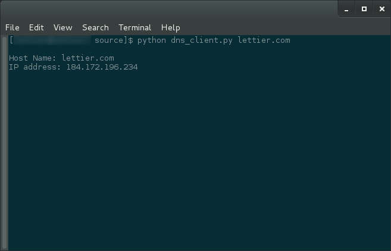

# A Python DNS Client

This DNS client is similar in nature to `nslookup` or `host` but only deals with A records.
Note that this DNS client does not use any DNS libraries but rather works directly
at the [DNS protocol level](http://technet.microsoft.com/en-us/library/dd197470).

# Quick Start

```bash
cd ~/Downloads
git clone https://github.com/lettier/dnsclient.git
cd dnsclient
virtualenv venv-dns-client
cd venv-dns-client
source bin/activate
cp -R ../src .
cp ../requirements.txt .
pip install -r requirements.txt
cd src
chmod +x dns_client.py
./dns_client.py lettier.com
```

# Copyright

_(C) 2014 David Lettier_  
[lettier.com](http://www.lettier.com/)
